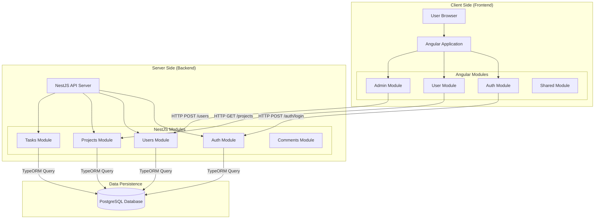

# CDL Project Management System - Full Stack Architecture

## 1. High-Level Architecture Diagram

## 2. Data Flow & Communication

The application follows a classic **Client-Server** architecture using **RESTful APIs**.

### **Step-by-Step Data Flow (Example: User Login)**
1.  **User Action**: User enters credentials on `LoginComponent` (Frontend).
2.  **Service Call**: `LoginComponent` calls `AuthService.login(email, password)`.
3.  **HTTP Request**: `AuthService` sends an HTTP `POST` request to `http://localhost:3000/auth/login`.
4.  **Controller Handling**: NestJS `AuthController` receives the request at `@Post('login')`.
5.  **Business Logic**: Controller delegates to `AuthService` (Backend) to validate user.
6.  **Database Query**: `AuthService` calls `UsersService`, which uses **TypeORM** to query the `users` table in PostgreSQL.
7.  **Response**: 
    *   If valid, Backend returns a JSON object (User details + JWT Token).
    *   Frontend `AuthService` stores the user/token in `localStorage`.
    *   User is redirected to `DashboardWrapperComponent`.

### **Step-by-Step Data Flow (Example: Loading Projects)**
1.  **Component Init**: `UserDashboardComponent` initializes.
2.  **Service Call**: Calls `ProjectService.getAssignedProjects(userId)`.
3.  **HTTP Request**: Sends `GET` to `http://localhost:3000/projects/user/:id`.
4.  **Backend Route**: `ProjectsController` handles `@Get('user/:userId')`.
5.  **Database Retrieval**: `ProjectsService` queries `projects` table, joining `project_stages` and `tasks`.
6.  **Data Return**: JSON array of Project objects is returned to the Frontend.
7.  **View Update**: Angular binds this data to the HTML template (`*ngFor`) to display project cards.

---

## 3. Directory Structure & Key Files

### **Frontend (`/frontend/src/app`)**
*   **`app.module.ts`**: Root module, imports all other modules and configures global providers.
*   **`app-routing.module.ts`**: Defines URL routes (`/login`, `/dashboard`, `/projects/:id`).
*   **`auth/`**: Authentication logic.
    *   `login/`, `register/`: Components for user entry.
*   **`user/`**: User-facing features.
    *   `user-dashboard/`: Main view for standard users/PMs.
    *   `project-page/`: Detailed view of a single project.
    *   `user-profile/`: Profile settings and view.
*   **`admin/`**: Admin-specific features.
    *   `admin-dashboard/`: Admin overview and user management.
*   **`shared/`**: Reusable code.
    *   `services/`: **CRITICAL**. Contains `AuthService`, `ProjectService`, `TaskService`. These are the bridge to the Backend.
    *   `guards/`: `AuthGuard` (protects routes), `RoleGuard` (admin-only routes).
    *   `models/`: TypeScript interfaces mirroring the DB schema (`Project`, `User`, `Task`).

### **Backend (`/backend/src`)**
*   **`main.ts`**: Entry point. Configures CORS, ValidationPipes, and starts the server on port 3000.
*   **`app.module.ts`**: Root module. Connects to Database and aggregates feature modules.
*   **`modules/`**: Feature-based separation.
    *   **`auth/`**: `AuthController` (endpoints), `AuthService` (logic).
    *   **`users/`**: `UsersController` (CRUD users), `User` entity.
    *   **`projects/`**: 
        *   `projects.controller.ts`: Handles `/projects` endpoints.
        *   `entities/project.entity.ts`: Defines `projects` table schema.
    *   **`tasks/`**: Task management logic.
    *   **`comments/`**: Commenting system logic.

---

## 4. Database Schema (PostgreSQL)

The database `cdl_management` consists of the following relational tables:

### **1. `users`**
*   **PK**: `id` (UUID)
*   **Fields**: `name`, `email`, `password`, `role` (admin, project_manager, etc.), `avatar`.
*   **Relationships**: 
    *   One-to-Many with `projects` (as Project Manager).
    *   Many-to-Many with `project_stages` (via `stage_assignments`).
    *   Many-to-Many with `tasks` (via `task_assignments`).

### **2. `projects`**
*   **PK**: `id` (UUID)
*   **Fields**: `name`, `platform` (flame/swayam), `status`, `deadline`.
*   **FK**: `project_manager_id` -> `users.id`.
*   **Relationships**: One-to-Many with `project_stages`.

### **3. `project_stages`**
*   **PK**: `id` (UUID)
*   **Fields**: `name` (Pre-Production, Production, etc.), `status`, `is_open`.
*   **FK**: `project_id` -> `projects.id`.
*   **Relationships**: 
    *   One-to-Many with `tasks`.
    *   Many-to-Many with `users` (Assigned team members).

### **4. `tasks`**
*   **PK**: `id` (UUID)
*   **Fields**: `name`, `description`, `start_date`, `end_date`, `status`.
*   **FK**: `stage_id` -> `project_stages.id`.
*   **Relationships**: Many-to-Many with `users` (Assignees).

### **5. Junction Tables**
*   **`stage_assignments`**: Links `project_stages` <-> `users`.
*   **`task_assignments`**: Links `tasks` <-> `users`.

---

## 5. Technology Stack

*   **Frontend**: Angular 16+, TypeScript, HTML5, CSS3 (Vanilla/Custom).
*   **Backend**: NestJS (Node.js framework), TypeScript.
*   **Database**: PostgreSQL 14+.
*   **ORM**: TypeORM (for database interactions).
*   **Authentication**: JWT (JSON Web Tokens).
